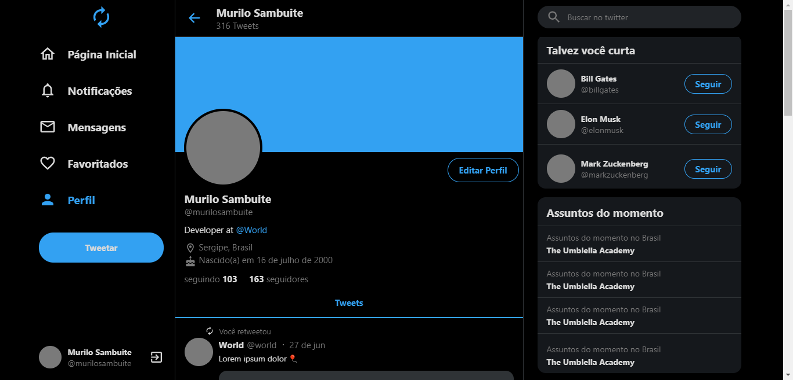
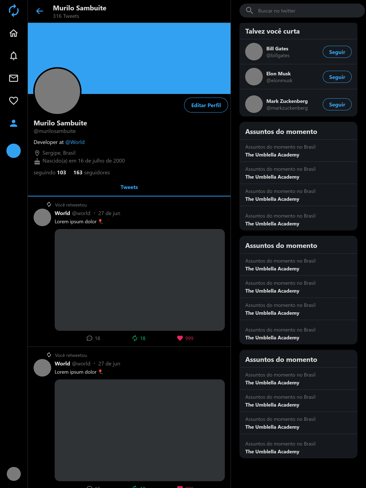
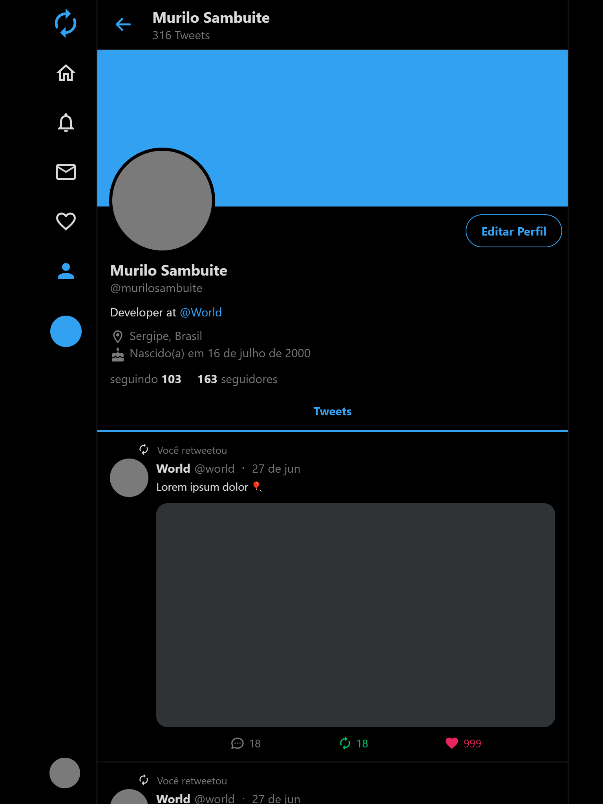
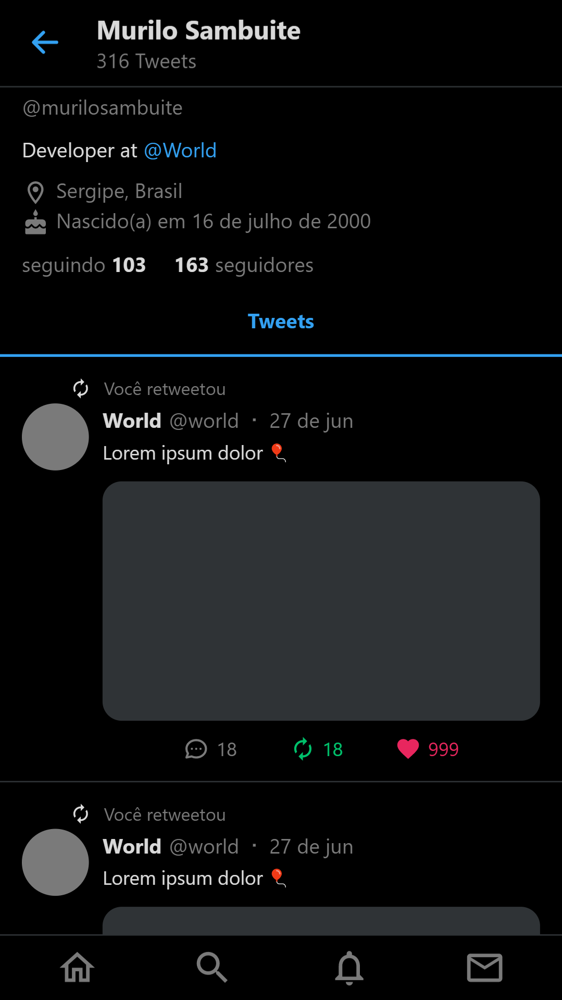

# Twitter Clone

<p align="center">
  
</p>

<p align="center">
  
</p>

<p align="center">
  
</p>

<p align="center">
  
</p>

<br>

## Installation

### Step by step to run the application on your machine:

Clone this repository:

```
  git clone https://github.com/sambuite/twitter-clone.git

  cd twitter-clone
```

Run the following scripts :

```
  // Install the dependencies
  npm install

  // Start the application
  npm start
```
